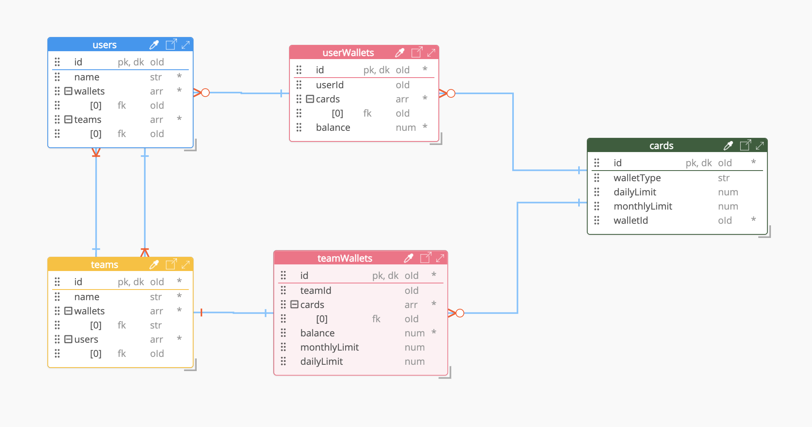

## Schema Design

### Assumptions

1. Greenfield project/ free choice of data store
2. Domains (users, wallets, cards, team) can be in different services and dbs or same db, isolated collection/ table depending on other constraints
3. Eventual consistency is ok in distributed setup for some updates
4. DEBIT/ CREDIT should satisfy ACID
5. Reads: `users, wallets, cards, team` are Read heavy assuming queries ex:
   - Fetch a user's wallets balance, card status
   - Fetch a team's wallets balance, card status
   - Fetch transactions in a wallet
   - Aggregate wallets with balance > X amount/ transactions etc
  
6. Writes: `wallets, cards` are relatively Writes heavy 
   - Transfer from one wallet to another using a card
   - Deduct balance for X(fee, debit etc) reasons

7. Writes: Users, team domains are relatively low on Writes
   - Update user details
   - Additions/ deletion to team
   - Link a new wallet/ card to user
8. In gist: transactions/ writes using cards, wallets are more frequent than user/ team modifications
9. Storage is cheaper. Or in other words optimize for ops performance over storage taken
10. Minimal relation between user wallet and team wallet and fewer ops if any (like: aggregation on total balance of satisfying Y conditions)

### Choices 

With above assumptions, below choices are made

1. mid level normalization ...not 3NF nor 1NF
2. Going with NoSql/ document type DB (mongodb in our implementation)
3. Going by the principle of mongo schema design => "Model the schema optimizing in the way that it's being fetched"
4. Optimise on reads for read use cases by embedding/ duplicating the data to be fetched 
5. Constraint to remember: Not have ever growing array structure within an document
6. Have isolation such a way that if domains are separated down to multiple services/ dbs for scalability our solution is extensible
7. ACID on balance updates using mongo's transaction sessions API(uses 2PC)
8. No indexing on heavily updated fields
9. Index on commonly fetched fields
10. Eventually consistency for other(non transactional) updates
11. Query from secondaries for uses where eventually consistency suffices
12. Having separate collection for userWallet and teamWallet for optimizing on reads/ writes

## The Design

| Relationships | Cardinality/ map |
| ------ | ------ |
| users -> teams | M -> N |
| users -> userWallets | 1 -> N |
| userWallets -> cards | 1 -> N |
| teams -> teamWallets | 1 -> 1 |
| teamWallets -> cards | 1 -> N |

Notes:
- user/ team collection will have some (name, expiry) duplicated data related to wallets for optimizing on the reads which aren't changed frequently
- Same applies to cards info in wallet
- Updates of balance/ limits are transactional using 2PC
- If each domains are owned by different service, and event driven flow -> Saga pattern to rollup and rollback can be one good option

